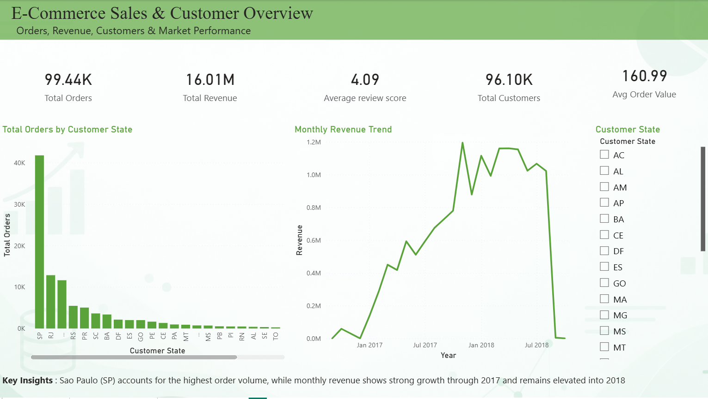
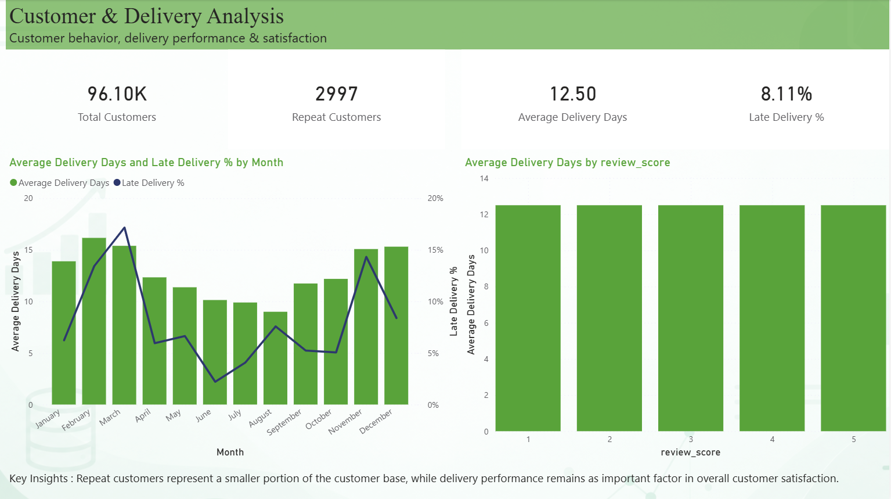

# 🛒 E-Commerce Sales, Customer & Delivery Analytics

## 📌 Project Overview

This project analyzes the **Olist Brazilian E-Commerce dataset** to understand sales performance, customer behavior, product performance, payment methods, and delivery performance.

The project follows an end-to-end **Data Analyst workflow** using SQL, Python, and Power BI.

---

## 🎯 Business Objectives

- Analyze overall sales and revenue performance
- Identify top-performing product categories
- Analyze seller performance
- Understand customer distribution and repeat customers
- Analyze payment method usage and revenue contribution
- Measure delivery performance and late deliveries
- Analyze customer review scores
- Identify monthly sales and revenue trends

---

## 🛠️ Tools & Technologies

- **SQL** – MySQL
- **Python** – Pandas, NumPy, Matplotlib, Seaborn
- **Power BI** – Interactive dashboards and business reporting
- **Jupyter Notebook** – Data cleaning and exploratory data analysis
- **GitHub** – Project version control and portfolio

---

## 📂 Dataset

**Olist Brazilian E-Commerce Public Dataset**

The dataset contains approximately 100K orders from the Brazilian e-commerce marketplace Olist.

### Main Tables

- Customers
- Orders
- Order Items
- Products
- Payments
- Reviews
- Sellers
- Product Category Translation

> The original dataset files are not included in this repository because of file-size limitations. The project analysis was performed using the original Olist dataset.

---

## 🔄 Project Workflow

```text
Raw Dataset
     ↓
Data Cleaning
     ↓
SQL Analysis
     ↓
Python EDA
     ↓
Feature Engineering
     ↓
Power BI Dashboard
     ↓
Business Insights📊 Key KPIs
KPI
Value
Total Orders
99.44K
Total Revenue
16.01M
Unique Customers
96.10K
Average Order Value
160.99
Average Review Score
4.09
Average Delivery Days
12.50
Repeat Customers
2,997
Late Delivery Rate
~8.11%
📈 Power BI Dashboard
Page 1 – Executive Overview
Provides an overview of:
Total Orders
Total Revenue
Total Customers
Average Review Score
Average Order Value
Monthly Revenue Trend
Orders by Customer State
�
Page 2 – Product & Payment Analysis
Analyzes:
Revenue by Payment Type
Revenue Contribution by Product Category
Top 10 Sellers by Revenue
Top 10 Product Categories by Revenue
�
Page 3 – Customer & Delivery Analysis
Analyzes:
Unique Customers
Repeat Customers
Average Delivery Days
Late Delivery %
Delivery performance by month
Delivery days by review score
�
🧮 SQL Analysis
The SQL analysis covers:
Total Orders
Unique Customers
Total Revenue
Average Order Value
Payment Method Usage
Revenue by Payment Method
Monthly Orders
Monthly Revenue
Top Product Categories
Top Sellers
Orders by State
Average Delivery Days
Late Delivery Percentage
Review Score Distribution
Repeat Customer Analysis
SQL file:
SQL/ecommerce_analysis_sql
🐍 Python EDA
Python was used for:
Data loading
Data cleaning
Missing-value analysis
Date conversion
Feature engineering
Monthly trend analysis
Product category analysis
Delivery analysis
Review score analysis
Repeat customer analysis
Notebook:
Python/01_Ecommerce_EDA.ipynb
🔍 Feature Engineering
Important features created during analysis include:
delivery_days
delivery_delay
order_month
is_late
revenue
These features were used for deeper business analysis and Power BI reporting.
💡 Key Business Insights
Credit-card payments contribute the largest share of payment revenue.
A relatively small group of customers make repeat purchases.
Product revenue is concentrated among a group of high-performing categories.
Delivery performance varies across months.
Customer reviews can be analyzed alongside delivery performance to understand customer satisfaction.

## 📊 Dashboard Preview

### Page 1 — Executive Overview


### Page 2 — Product & Payment Analysis


### Page 3 — Customer & Delivery Analysis


---
📁 Repository Structure
Olist-Ecommerce-Sales-Analytics/
│
├── Dashboard/
│   ├── Page1_executive_overview.png
│   ├── page2_product_payment.png
│   └── page3_customer_delivery_dashboard.png
│
├── Python/
│   └── 01_Ecommerce_EDA.ipynb
│
├── SQL/
│   └── ecommerce_analysis_sql
│
├── data/
│   └── README.md
│
└── README.md
🚀 Skills Demonstrated
Data Cleaning
Exploratory Data Analysis
SQL Querying
KPI Development
Business Analysis
Data Visualization
Power BI Dashboard Development
Customer Analytics
Sales Analytics
Delivery Performance Analysis
GitHub Portfolio Management
👨‍💻 Author
Sai Kumar Podili
B.Tech – Computer Science & Engineering (AI & ML)
Interested in Data Analytics, Data Science and AI/ML.
⭐ This project demonstrates an end-to-end approach to transforming raw e-commerce data into actionable business insights.

